# Vault — Page Screenshots

Visual tour of the main screens, in typical usage order. Return to the project overview in [`README.md`](README.md).

---

## Auth & setup

### 🔧 Setup (`/setup`)

First-time vault password creation.

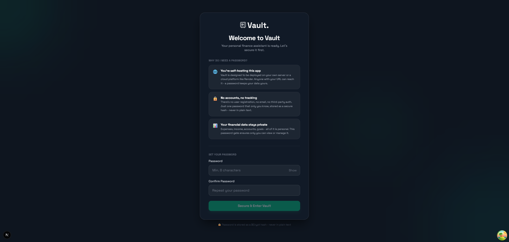

---

## Core app

### 📊 Dashboard (`/dashboard`)

Financial snapshot — net worth, cash flow, budget highlights, category focus, and trends.

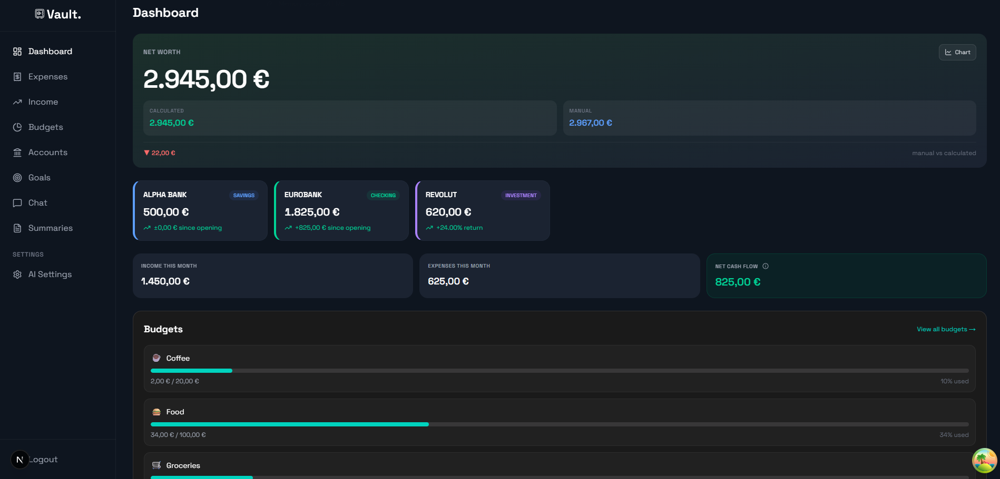

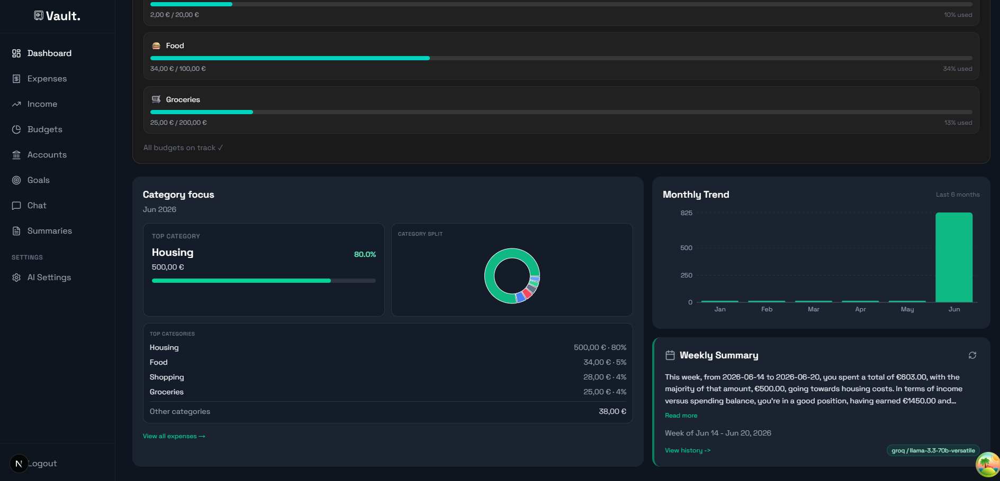

### 💸 Expenses (`/expenses`)

Track spending by category and account; year heatmap, filters, and search.

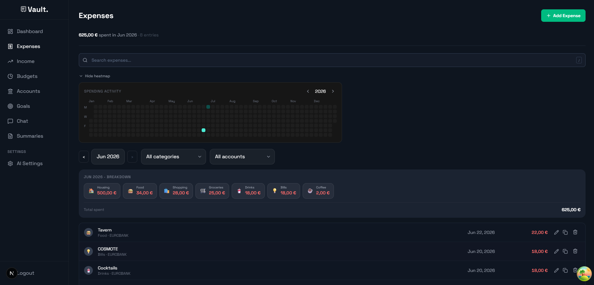

### 📈 Budgets (`/budgets`)

Monthly category limits, progress badges, copy from prior month, and dashboard pins.

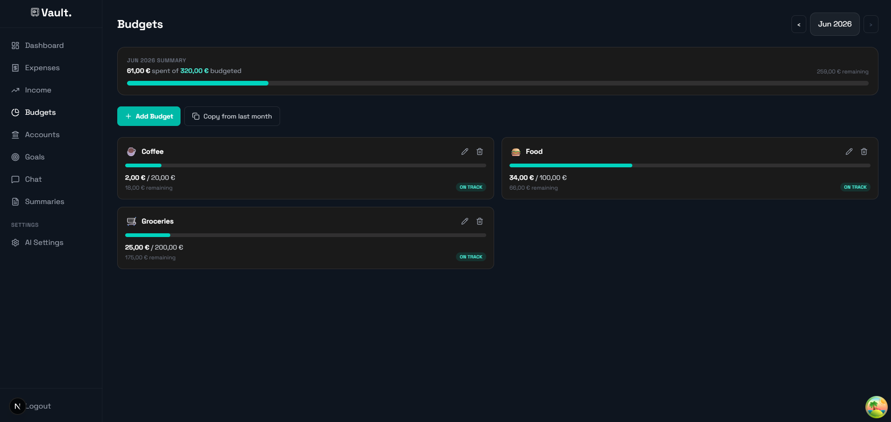

### 💰 Income (`/income`)

Income entries by category and account with monthly summaries.

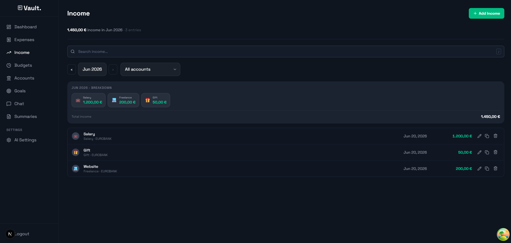

### 🏦 Accounts (`/accounts`)

Account grid — balances, edit, details, and delete.

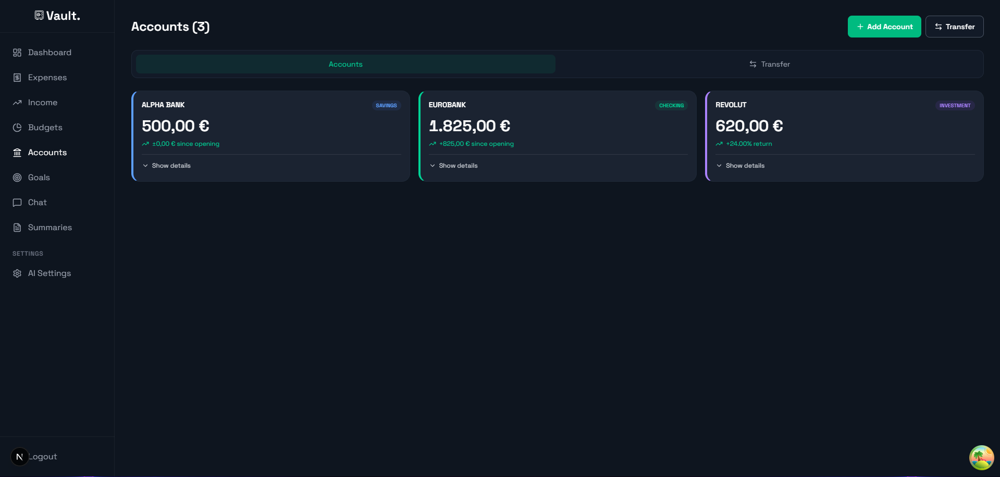

### 🔁 Transfers (`/accounts` — Transfer tab)

Move money between accounts; per-account history and revert.

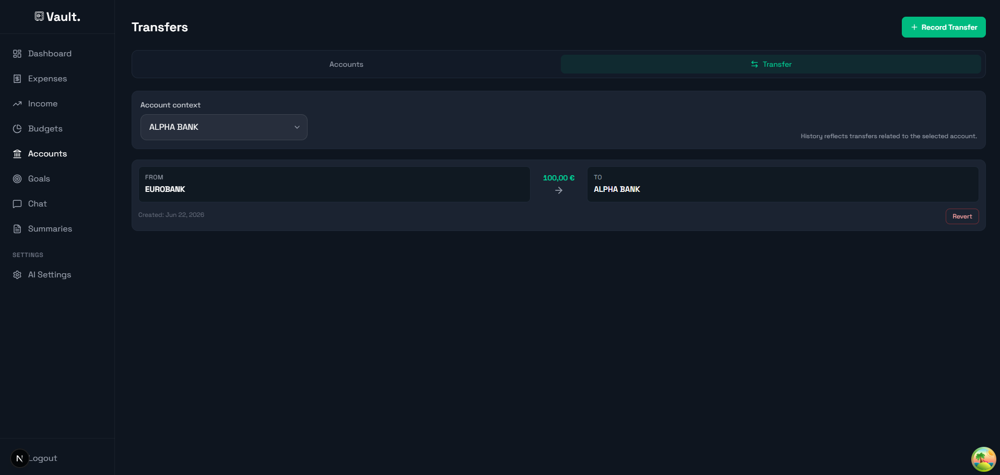

### 📉 Account detail — investments (`/accounts/[id]`)

Investment checkpoints, return metrics, and value-over-time chart.

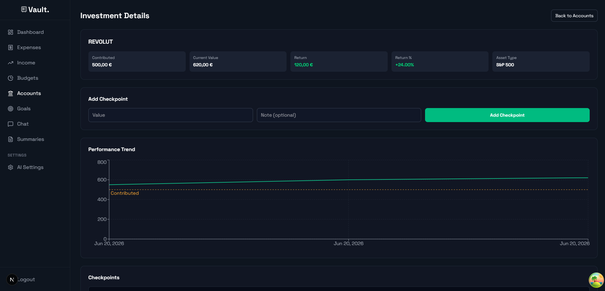

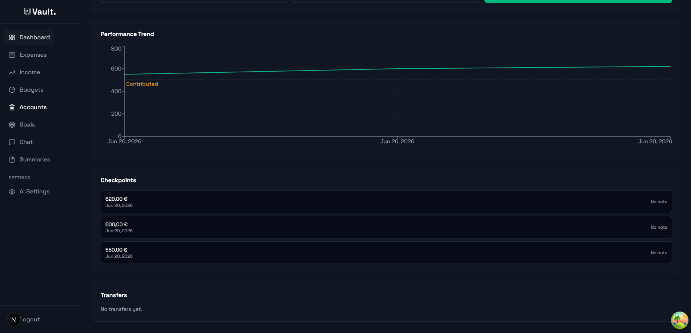

### 🎯 Goals (`/goals`)

Savings goals with linked accounts and progress tracking.

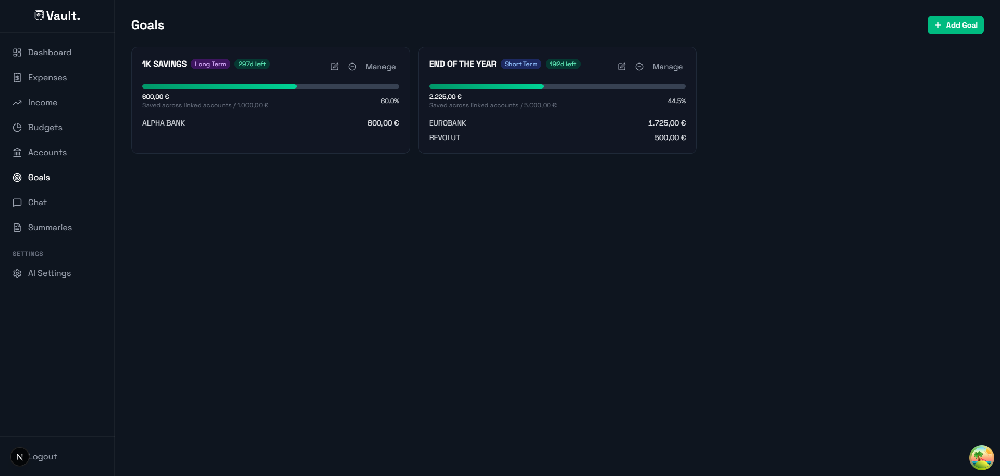

---

## AI

### 🤖 AI Chat (`/chat`)

Conversational insights over your financial data.

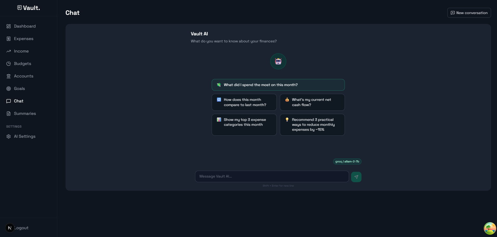

### 📋 Weekly Summaries (`/ai/summaries`)

Browse, generate, and manage weekly AI summaries.

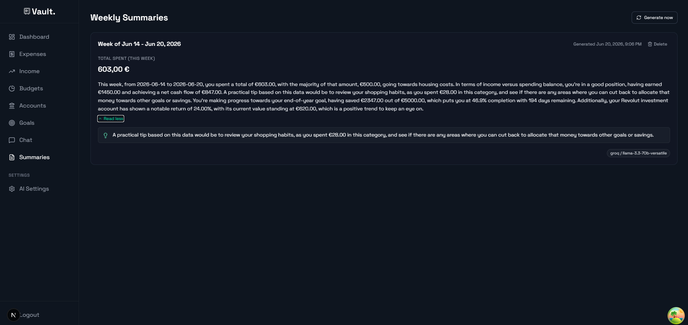

---

## Settings

### ⚙️ AI settings (`/settings/ai`)

Choose provider and model for chat and summary tasks.

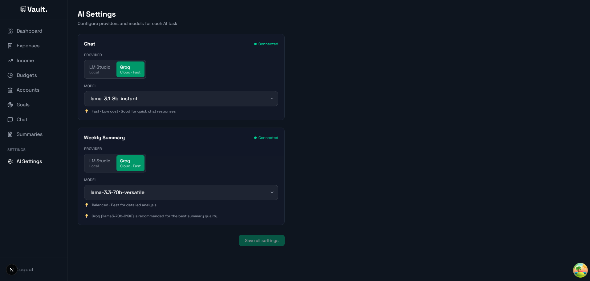
