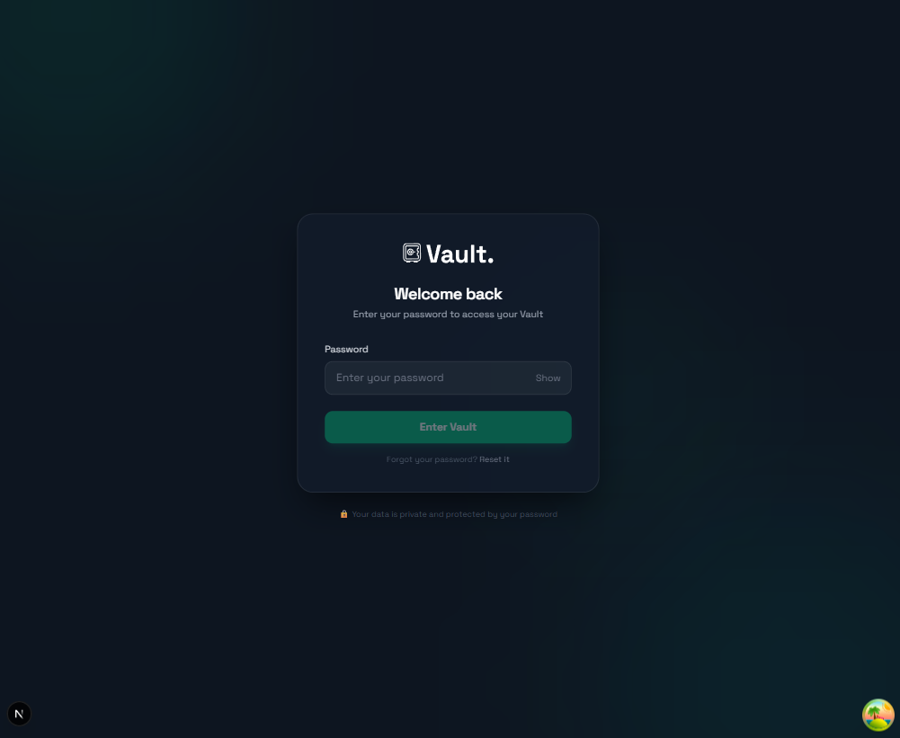
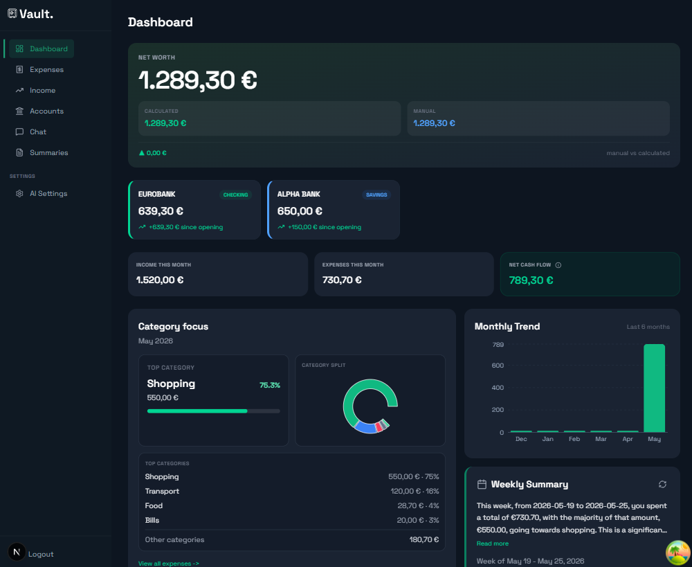
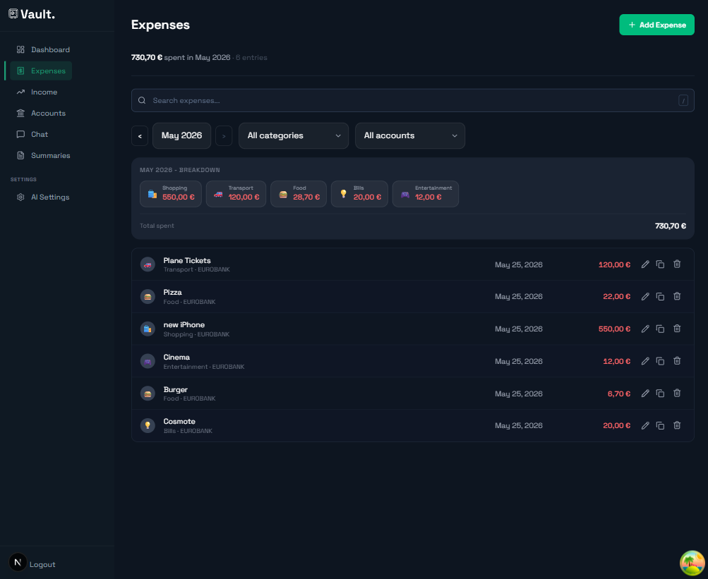
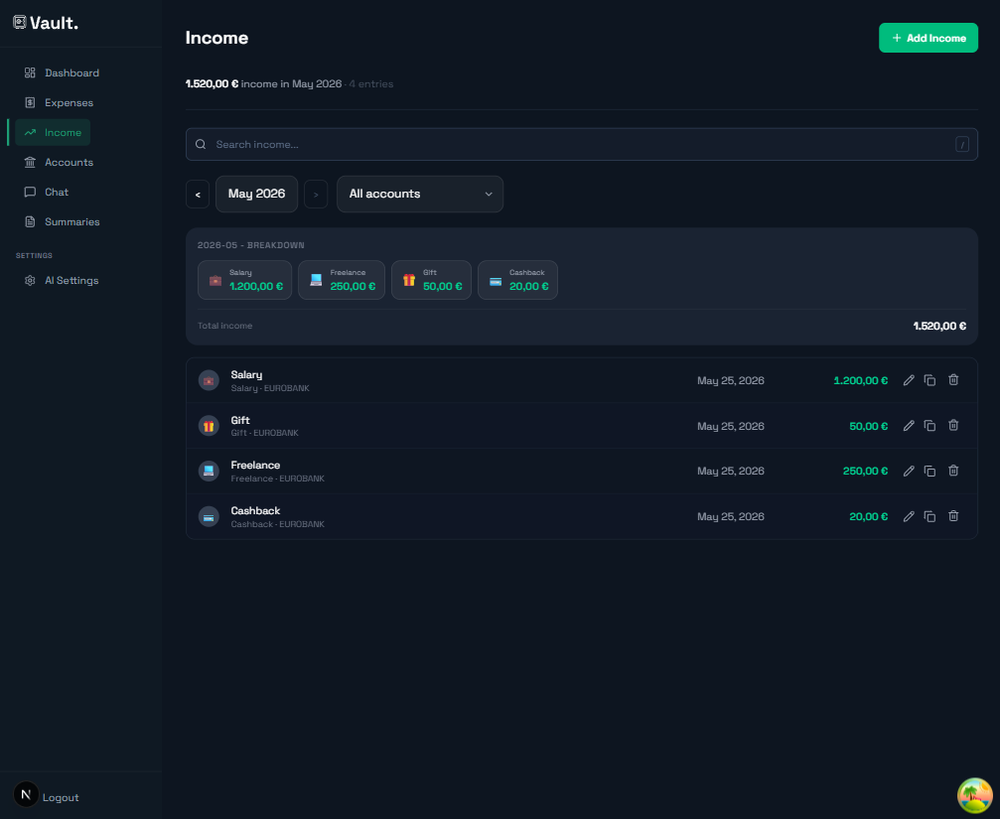
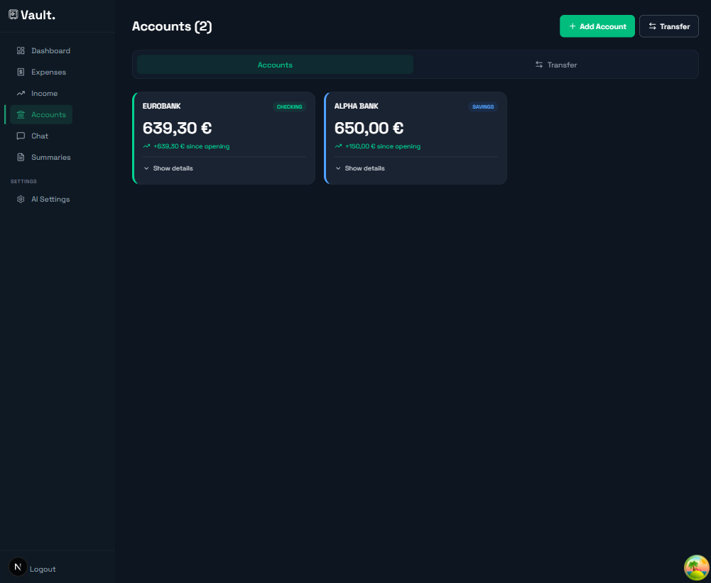
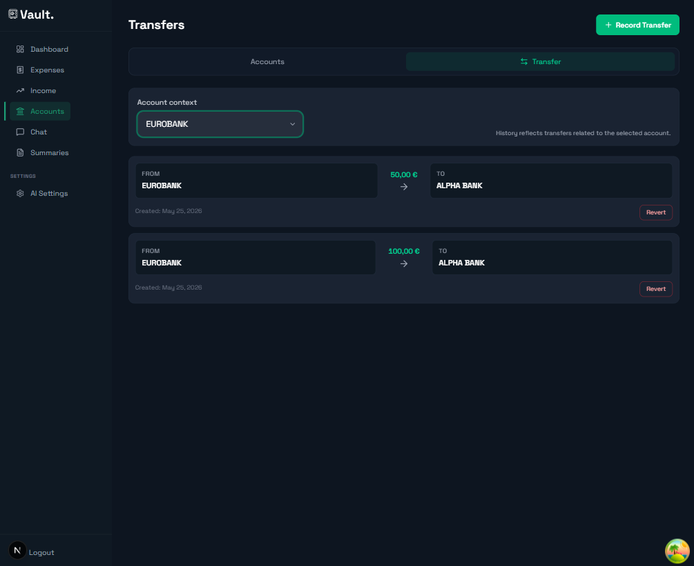
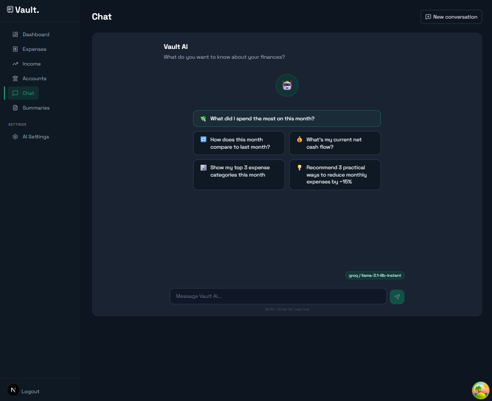
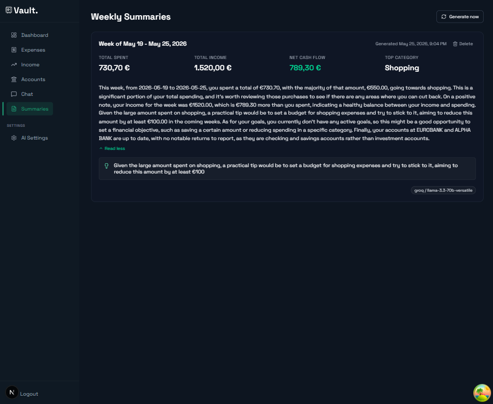

# Vault Frontend

> A personal finance app to track expenses and income, set category budgets, manage multiple accounts, set savings goals, and use AI for summaries and chat insights.

Built with **Next.js 16** (App Router), **React 19**, **TypeScript**, **Tailwind CSS v4**, **TanStack Query**, **Recharts**, and **Axios**. The app proxies API calls to a Spring Boot backend.

#### 🔐 Login


#### 📊 Dashboard


#### 💸 Expenses


#### 💰 Income


#### 🏦 Accounts


#### 🔁 Transfers


#### 🤖 AI Chat


#### 📋 Weekly Summaries


---

## What You Can Do In Vault

- See your financial snapshot on the dashboard (net worth with optional trend chart, cash flow, budget highlights, category focus, monthly comparisons, 6-month trend)
- Set monthly category budgets, track spending vs. plan, copy budgets from the prior month, and pin up to three budgets to the dashboard
- Track expenses by category, account, and month — with a year-over-year spending heatmap, day-click filtering, search, and duplicate-from-entry
- Track income entries by category and account — with search and duplicate-from-entry
- Manage checking, savings, and investment accounts with calculated and manual balances
- Create transfers between accounts, review per-account transfer history, and revert transfers
- Open account detail pages for investment checkpoints, return metrics, and transfer history
- Create savings goals, link accounts for progress tracking, and manage contributions
- Ask Vault AI questions about your finances in chat (with suggested prompts)
- Generate, browse, and delete weekly AI summaries
- Configure separate AI providers/models for chat and summary tasks

---

## Before You Start

You need two things running:

1. Vault backend API (Spring Boot)
2. This frontend (Next.js)

The frontend talks to the backend for all data and authentication.

From the backend architecture:

- Auth is password-gated (single vault password)
- JWT is stored in both `localStorage` (Bearer token for API calls) and an HttpOnly `vault_token` cookie (page gating)
- First-time users must run setup and create a vault password
- Regular users log in with that password

For backend architecture and endpoint details, see [`ARCHITECTURE.md`](ARCHITECTURE.md).

---

## Quick Setup

### 1. Install dependencies

```bash
npm install
```

### 2. Configure environment

Create a file named `.env.local` in the project root (see [`.env.example`](.env.example)):

```env
API_URL=http://localhost:8080
NEXT_PUBLIC_APP_URL=http://localhost:3000
NEXT_PUBLIC_API_URL=http://localhost:8080
PASSWORD_RESET_TOKEN=your-reset-token-here
```

| Variable | Purpose |
|---|---|
| `API_URL` | Backend URL used by Next.js API route proxies (server-side) |
| `NEXT_PUBLIC_API_URL` | Backend URL exposed to the browser (if needed) |
| `NEXT_PUBLIC_APP_URL` | Frontend origin used by page guard for auth status checks |
| `PASSWORD_RESET_TOKEN` | Self-hosted password reset token (optional) |
| `API_ADMIN_TOKEN` | Optional admin token forwarded on reset-password proxy calls |

Adjust the URLs to match where your backend is running. `PASSWORD_RESET_TOKEN` is only needed for self-hosted deployments without email — see [Password reset](#password-reset-self-hosted).

### 3. Start the frontend

```bash
npm run dev
```

Open http://localhost:3000

Production builds use Next.js `output: "standalone"` — run with `npm run build` then `npm run start`.

### 4. First run flow

When you open the app:

1. If the backend is unreachable, you are sent to `/starting` (polls until the backend is up)
2. If the backend is up but not configured, you are sent to `/setup`
3. Create your vault password once
4. You are redirected into the app
5. Later visits go through `/login` using the same password

---

## Typical Usage Flow

1. Create one or more accounts (checking, savings, or investment)
2. Add income and expense entries linked to accounts
3. Set monthly category budgets and review progress on the Budgets page or dashboard highlights card
4. Record transfers between accounts when moving money
5. Review dashboard metrics — toggle the net worth chart, check budget alerts, and explore category focus and monthly breakdowns
6. Use the expense heatmap to spot spending patterns and drill into a specific day
7. Set goals, link accounts, and track progress
8. Ask Vault AI questions or generate weekly summaries

---

## Main Pages

| Route | Description |
|---|---|
| `/dashboard` | Net worth card (calculated + manual drift, toggleable area chart from monthly cash flow), account strip, income/expense stats, net cash flow, budget highlights with alerts and pin picker, category focus donut chart, 6-month cash-flow trend, latest weekly summary card |
| `/expenses` | CRUD expenses; collapsible year heatmap with day-click date filter; filter by month, category, and account; text search; duplicate entries; monthly total and category breakdown |
| `/budgets` | Monthly category budgets — add/edit/delete limits, month summary bar, status badges (on track / warning / over budget), copy from last month, pin up to 3 budgets for the dashboard |
| `/income` | CRUD income; filter by month and account; text search; duplicate entries; monthly summary by category |
| `/accounts` | Two tabs — **Accounts** (grid with update balance, edit, details, delete; stale-balance warnings) and **Transfer** (create transfers, per-account history, revert flow) |
| `/accounts/[id]` | Account detail — investment return metrics, value-over-time chart, manual balance update, investment checkpoints, transfer history |
| `/goals` | Create/edit goals (short-term or long-term), link/unlink accounts, progress bars, deactivate with confirm |
| `/chat` | Conversational AI over your financial data; suggested prompts; shows active chat provider/model |
| `/ai/summaries` | List weekly AI summaries, generate new ones, expand/truncate text, delete with double-confirm |
| `/settings/ai` | Pick provider and model separately for **Chat** and **Summary** tasks (LM Studio, Groq) |

### Auth & utility pages (no sidebar)

| Route | Description |
|---|---|
| `/login` | Vault password login; link to reset password |
| `/setup` | First-time vault password creation |
| `/reset-password` | Self-hosted password reset flow |
| `/starting` | Lightweight cold-start page while backend warms up |

---

## Project Structure

```
src/
├── app/                    # Next.js App Router pages and API routes
│   ├── api/auth/           # Auth proxies (login, setup, logout, refresh, reset-password, status)
│   ├── api/v1/[...path]/   # Catch-all proxy to backend /api/v1/*
│   ├── dashboard/
│   ├── expenses/
│   ├── budgets/
│   ├── income/
│   ├── accounts/           # List + /[id] detail
│   ├── goals/
│   ├── chat/
│   ├── ai/summaries/
│   └── settings/ai/
├── components/             # UI by domain (accounts, budgets, chat, dashboard, expenses, goals, income, settings, ui)
├── lib/
│   ├── api.ts              # Axios client + typed API functions
│   ├── auth.ts             # Token helpers (localStorage)
│   ├── hooks/              # TanStack Query hooks per domain
│   ├── queryKeys.ts        # Centralized React Query keys
│   └── utils.ts            # Formatting, dates, currency
├── types/                  # Shared TypeScript interfaces
└── proxy.ts                # Page guard (auth status, cookie check, redirects)
```

---

## Data Layer

All backend communication goes through `src/lib/api.ts` (Axios, base `/api/v1`) or `apiFetch` (fetch with 503 retry for GET). React Query hooks in `src/lib/hooks/` wrap each domain.

---

## Operational Notes

- **Cold-start handling** — when the backend is unreachable (cold start or redeploy) the page guard redirects to `/starting` instead of mounting full pages or sending users to `/setup`. This reduces noisy API calls and avoids accidental setup lockouts.
- **Resilient auth flows** — auth proxy routes (`/api/auth/login`, `/api/auth/setup`) and the Axios client retry transient 502/503/504 errors during backend startup. `apiFetch` retries GET requests on 503 with exponential backoff.
- **Hybrid auth** — API calls use a Bearer token in `localStorage`; page navigation is gated by an HttpOnly `vault_token` cookie. `TokenRefresher` keeps both in sync on app load.
- **Self-hosted password reset** — for deployments without email, a `reset-password` flow exists. The frontend proxies reset requests to the backend and may forward `API_ADMIN_TOKEN` or an `x-reset-token` header.
- **UI simplification** — the previous Security settings tab was removed; a `Reset password` link is available on the login page. Auth and `/starting` pages render without the main sidebar.
- **Accounts UX** — primary card action is **Update Balance**; secondary row has Edit, Details, Delete. Transfers live on the Accounts page Transfer tab (not a separate nav item). Revert is hidden for entries that are already reversals.
- **Dashboard deduplication** — category details are centralized in the Category focus card instead of repeating top-category logic elsewhere.
- **Net worth chart** — the dashboard Net Worth card toggles between summary and an area chart built from the last several months of net cash flow (estimated trend, not stored snapshots).
- **Budget highlights** — pin up to three category budgets per month on the Budgets page; the dashboard card shows pinned budgets, auto-fills when fewer than three exist, and surfaces over-budget alerts. Pinned IDs persist in `localStorage`.
- **Expense heatmap** — GitHub-style calendar on the Expenses page; click a day to filter the list and category breakdown to that date.
- **Investment details** — account detail page shows asset type, platform, instrument, checkpoints, and return metrics when available.

---

## Scripts

```bash
npm run dev      # Development server
npm run build    # Production build (standalone output)
npm run start    # Run standalone server
npm run lint     # ESLint
```

---

## Troubleshooting

### Frontend starts but no data loads

- Check that backend is running
- Check `.env.local` has the correct `API_URL`
- Confirm backend allows requests from your frontend origin
- During backend redeploy/cold-start you may be redirected to `/starting`. This page polls backend status and avoids mounting heavy pages while the backend warms up. If the backend is fully up and you still land on `/setup`, check the backend `/api/v1/auth/status` response.

### App keeps redirecting to login

- Session cookie or Bearer token may be expired or invalid
- Log in again with your vault password
- Ensure backend and frontend URLs match your environment setup

### Password reset (self-hosted)

- For single-instance/self-hosted deployments without email, set a reset token or admin token in your environment (see `.env.example`): `PASSWORD_RESET_TOKEN` and optionally `API_ADMIN_TOKEN`.
- The frontend exposes `/reset-password` which posts to `/api/auth/reset-password` and will set the `vault_token` cookie on success.

### Setup/Login returns too many attempts

- Backend applies rate limiting on auth endpoints (5 attempts per 15 minutes per IP)
- Wait and try again

---

